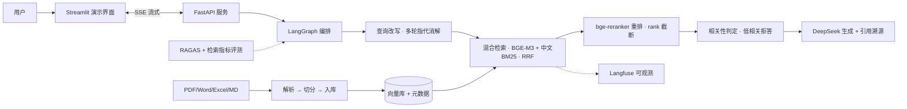

# EnterpriseRAG — 企业级智能知识库问答系统

面向企业内部文档的 RAG 知识库问答系统：多格式文档自动入库 → 查询改写 + 混合检索 + 重排 → 多轮对话 → SSE 流式输出 → 引用溯源。可评测（RAGAS）、可观测（Langfuse）、Docker 一键部署。

> 项目状态：🚧 开发中（M1：项目骨架 + 朴素 RAG 链路）

## 架构



## 技术栈

| 层 | 选型 |
|---|---|
| LLM | DeepSeek（langchain-deepseek，deepseek-chat） |
| Embedding / Rerank | BGE-M3 / bge-reranker-v2-m3（硅基流动 API，OpenAI 兼容） |
| 向量库 | Chroma（MVP）→ Qdrant（混合检索阶段） |
| 编排 | LangChain 1.x（LCEL）+ LangGraph |
| 后端 / UI | FastAPI / Streamlit |
| 评测 / 可观测 | RAGAS / Langfuse（自托管） |
| 部署 | Docker Compose |

## 检索指标表（每次里程碑更新）

| 里程碑 | 阶段 | Recall@5 | MRR | Hit@5 | 说明 |
|---|---|---|---|---|---|
| M2 | 基线（朴素稠密检索） | 0.940 | 0.900 | 0.940 | 50 题计分；短板：exact 0.750（编号/型号题）、table 0.929 |
| M3 | 混合检索（+中文BM25, RRF） | 1.000 | 0.905 | 1.000 | exact 0.750→1.000，table 0.929→1.000 |
| M5 | +重排 +拒答 | - | - | - | 待评测 |
| M6 | +Contextual Chunking +父子检索 | - | - | - | 待评测 |

## 快速开始

> **Windows 小白模式（推荐）**：双击三个脚本即可——
> ① `scripts\setup_env.bat`（自动创建 .env 并打开记事本，填入两个 key）
> ② `scripts\ingest_docs.bat`（把 samples\ 演示文档摄入知识库）
> ③ `scripts\dev_start.bat`（启动后端 + 网页界面）→ 浏览器打开 http://localhost:8501 提问

命令行模式（同上，手动执行）：

```bash
# 1. 安装依赖（uv，Python 3.12）
uv sync

# 2. 配置密钥（注册：platform.deepseek.com / siliconflow.cn 均有免费额度）
cp .env.example .env   # 填入 DEEPSEEK_API_KEY 与 SILICONFLOW_API_KEY

# 3. 启动后端（API 文档见 http://localhost:8000/docs）
uv run uvicorn app.main:app --reload

# 4. 摄入文档（samples/ 自带一份演示用《星火科技考勤管理制度》）
uv run python scripts/ingest.py default samples/

# 5. 启动演示 UI
uv run streamlit run ui/streamlit_app.py
```

## 项目结构

```
app/           后端主包（api / core / llm / ingestion / retrieval / rag / storage）
eval/          评测集 + RAGAS 评测脚本
tests/         单元 + 集成测试
scripts/       摄入 / 评测 / demo 脚本
ui/            Streamlit 演示界面
infra/         Langfuse 自托管 compose
```

参考的开源项目与设计借鉴见项目计划文档（RAGFlow 检索链路 / Onyx Contextual Chunking / QAnything 两阶段检索 / kotaemon 组件抽象）。
